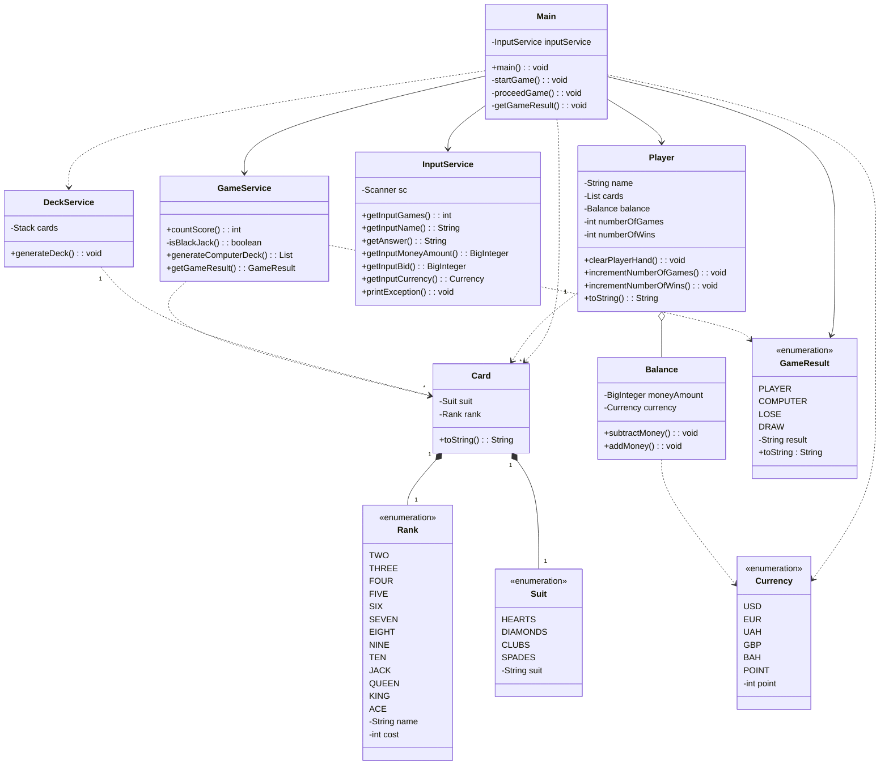

```mermaid
classDiagram
    class DeckService{
        -Stack<Card> cards
        +generateDeck() : void
    }
    class GameService{
        +countScore() : int
        -isBlackJack() : boolean
        +generateComputerDeck() : List
        +getGameResult() : GameResult
    }
    class InputService{
        -Scanner sc
        +getInputGames() : int
        +getInputName() : String
        +getAnswer() : String
        +getInputMoneyAmount() : BigInteger
        +getInputBid() : BigInteger
        +getInputCurrency() : Currency
        +printException() : void
    }
    class Main{
        -InputService inputService
        +main() : void
        -startGame() : void
        -proceedGame() : void
        -getGameResult() : void
    }
    class Player{
        -String name
        -List<Card> cards
        -Balance balance
        -int numberOfGames
        -int numberOfWins
        +clearPlayerHand() : void
        +incrementNumberOfGames() : void
        +incrementNumberOfWins() : void
        +toString() : String
    }
    class Balance{
        -BigInteger moneyAmount
        -Currency currency
        +subtractMoney() : void
        +addMoney() : void
    }
    class Card{
        -Suit suit
        -Rank rank
        +toString() : String
    }
    class Suit{
        <<enumeration>>
        HEARTS
        DIAMONDS
        CLUBS
        SPADES
        -String suit
    }
    class Currency{
        <<enumeration>>
        USD
        EUR
        UAH
        GBP
        BAH
        POINT
        -int point
    }
    class Rank{
        <<enumeration>>
        TWO
        THREE
        FOUR
        FIVE
        SIX
        SEVEN
        EIGHT
        NINE
        TEN
        JACK
        QUEEN
        KING
        ACE
        -String name
        -int cost
    }
    class GameResult{
        <<enumeration>>
        PLAYER
        COMPUTER
        LOSE
        DRAW
        -String result
        +toString : String
    }
    Main ..> DeckService
    Main --> GameService
    Main --> InputService
    Main --> Player
    Main ..> Currency
    Main ..> Card
    Main --> GameResult
    
    Player o-- Balance
    Player "1" ..> "*" Card
    
    Balance ..> Currency
    
    DeckService "1" ..> "*" Card
    
    GameService ..> Card
    GameService ..> GameResult
    
    Card "1" *-- "1" Rank
    Card "1" *-- "1" Suit
```