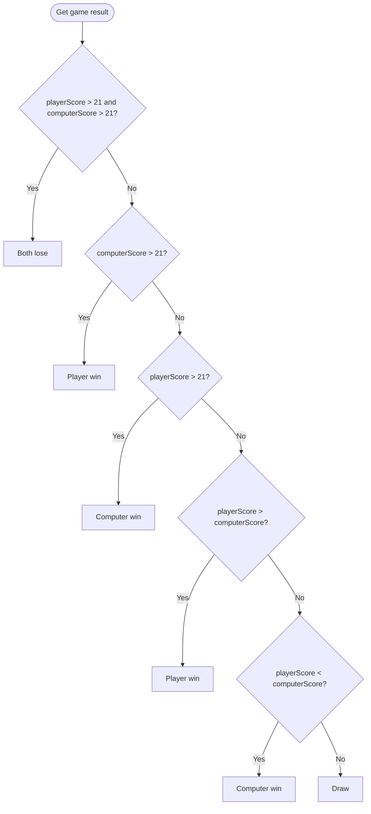

```mermaid
flowchart TB
    gameRes([Get game result])
    gameRes --> cond1{playerScore > 21 and computerScore > 21?}
    
    cond1 -->|Yes| ans[Both lose]
    cond1 -->|No| cond2{computerScore > 21?}

    cond2 --> |Yes| ans2[Player win]
    cond2 --> |No| cond3{playerScore > 21?}
    
    cond3 --> |Yes| ans3[Computer win]
    cond3 --> |No| cond4{playerScore > computerScore?}
    
    cond4 --> |Yes| ans4[Player win]
    cond4 --> |No| cond5{playerScore < computerScore?}
    
    cond5 --> |Yes| ans5[Computer win]
    cond5 --> |No| ans6[Draw]
```