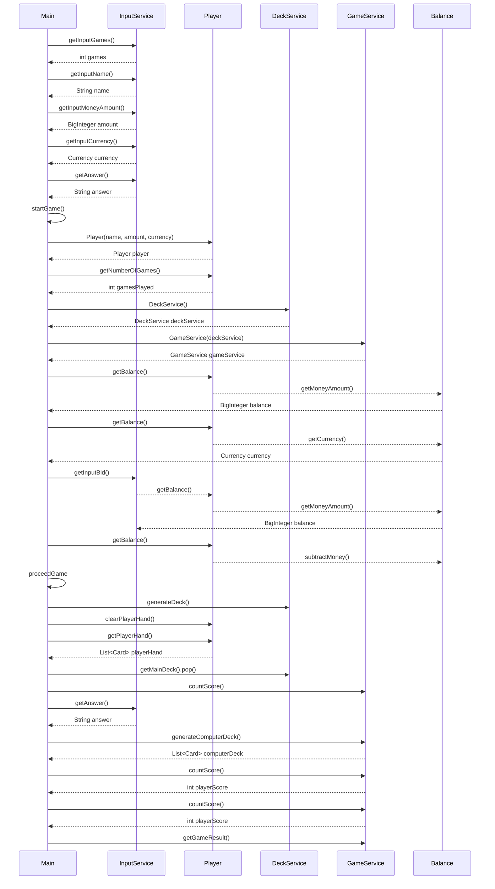

```mermaid
sequenceDiagram
    participant Main as Main
    participant InputService as InputService
    participant Player as Player
    participant DeckService as DeckService
    participant GameService as GameService
    participant Balance as Balance
    
    Main->>InputService: getInputGames()
    InputService-->>Main: int games

    Main->>InputService: getInputName()
    InputService-->>Main: String name

    Main->>InputService: getInputMoneyAmount()
    InputService-->>Main: BigInteger amount

    Main->>InputService: getInputCurrency()
    InputService-->>Main: Currency currency
    
    Main->>InputService: getAnswer()
    InputService-->>Main: String answer
    
    Main->>Main: startGame()
    
    Main->>Player: Player(name, amount, currency)
    Player-->>Main: Player player
    
    Main->>Player: getNumberOfGames()
    Player-->>Main: int gamesPlayed
    
    Main->>DeckService: DeckService()
    DeckService-->>Main: DeckService deckService
    
    Main->>GameService: GameService(deckService)
    GameService-->>Main: GameService gameService
    
    Main->>Player: getBalance()
    Player-->>Balance: getMoneyAmount()
    Balance-->>Main: BigInteger balance

    Main->>Player: getBalance()
    Player-->>Balance: getCurrency()
    Balance-->>Main: Currency currency
    
    Main->>InputService: getInputBid()
    
    InputService-->>Player: getBalance()
    Player-->>Balance: getMoneyAmount()
    Balance-->>InputService: BigInteger balance
    
    Main->>Player: getBalance()
    Player-->>Balance: subtractMoney()
    
    Main->>Main: proceedGame
    Main->>DeckService: generateDeck()
    
    Main->>Player: clearPlayerHand()
    
    Main->>Player: getPlayerHand()
    Player-->>Main: List<Card> playerHand
    
    Main->>DeckService: getMainDeck().pop()
    
    Main->>GameService: countScore()
    
    Main->>InputService: getAnswer()
    InputService-->>Main: String answer
    
    Main->>GameService: generateComputerDeck()
    GameService-->>Main: List<Card> computerDeck
    
    Main->>GameService: countScore()
    GameService-->>Main: int playerScore

    Main->>GameService: countScore()
    GameService-->>Main: int playerScore
    
    Main->>GameService: getGameResult()
```